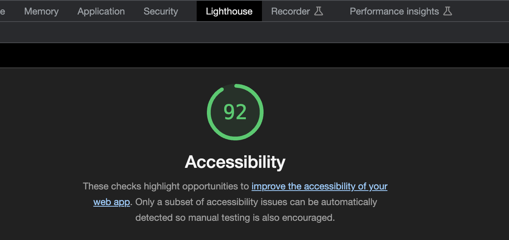

# About-Me

[Link to my project](https://katkho.github.io/About-Me/)

1. Created a list of top ten places to visit.
2. Added the 6th question for the quessing game. User has 4 attempts to guess the number.
3. Added the 7th question that has multiple possible correct answers. User has 6 attempts to guess.
4. Added the counter to track final score.

I was Navigator on: 
I was Driver on: 

Added icons and a personalized cursor.

